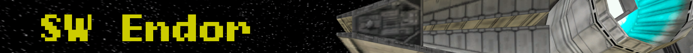
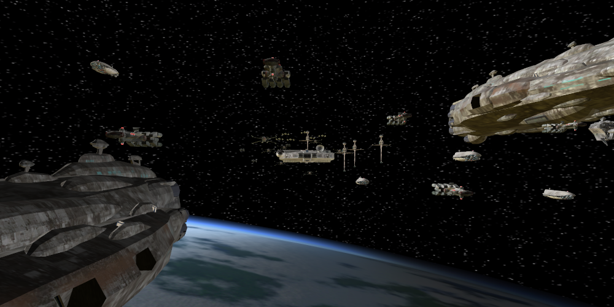
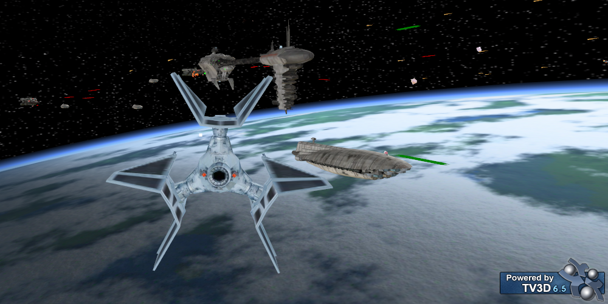
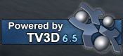

## About this Project

This is a re-creation of the free Star Wars games originally made by **Bruno. R. Marcos** back in the early 2000s. The [Battle of Endor](http://www.moddb.com/games/starwars-battle-of-endor) was the first of such game to be published by him, and the project name is thus named in this honor.

Mr. Marcos had also released the [Battle of Yavin](http://www.moddb.com/games/starwars-battle-of-yavin) a few years after. While Mr Marcos had released a preview of the [Escape from Hoth](https://www.youtube.com/watch?v=u1ug51qrJwc), the game was unfortunately not yet published at the making of this project (January 2018). Eventually, I hope this project can bring even that into fruition.

This non-commercial project aims to recreate the enjoyable (and rage-inducing, mostly rage-inducing) elements of the original projects by . The open-source nature of this project allows for expansion and improvement, which will hopefully bring about other elements that an fellow enthusiast can think up of. 

While this project begins as a recreation of Mr. Marco's SW games, this project's core is a 3D flight/combat simulator, and is thus not limited in content. You may use this to recreate a WWII scenario, for instance, should the right models and logical sequence are available.

 

This project is powered by [TrueVision3D 6.5](http://www.truevision3d.com/)(3D engine) and [FMOD](https://www.fmod.com/)(audio engine).

## Features

This project is still in the early stages, so content is still in the process of building up. The current stage of the project provides these options

- Fly a Rebel starfighter such as X-Wing, Y-Wing, A-Wing and B-Wing.

- Fly a Imperial starfighter from the TIE to the TIE Defender.

- Engage in dogfights with other fighters, or other warships if you dare.

- Depending on your loadout, choose between vaporizing your targets with lasers, hammering them with missiles or blasting them with torpedos.

- Reap woe on enemy warships and their defenses with ion cannons.

- Take on the challenge to write your very own campaign and scenario!

## Prerequisites

This project is created and maintained with Visual Studio 2015.

The game requires Microsoft .NET Framework v4.0.

The game uses [TrueVision3D 6.5](http://www.truevision3d.com/) to perform 3D rendering and calculations. 
TV3D requires at least DirectX 9 and a 32-bit 3D graphics card to run properly. TV3D can only be run on 32-bit Windows.

## Installation

Please view the [Basic documentation](doc/Basics.pdf) for guidelines on how to install and play the game. 

